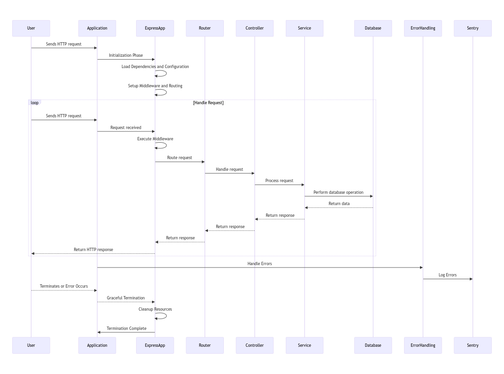

# Node Auth Rest API

[](LICENSE)

Node Auth Rest API is an open-source authentication RESTful API built with Node.js, Express, and MongoDB. It provides user registration, login, token generation, and logout functionality, allowing developers to easily integrate authentication into their Node.js applications. This API can serve as a standalone authentication system or be used as a boilerplate for building Node.js applications with pre-implemented authentication.

## Features

The NodeAuthRestAPI offers a comprehensive set of features designed to support secure and scalable RESTful API development with robust user authentication capabilities.

### 1. Authentication

- **User Registration and Login:**
    - Enables user registration with validation to ensure data integrity.
    - Facilitates user login with username and password, including validation checks.

- **JWT Token Authentication:**
    - Generates JWT (JSON Web Token) for secure authentication.
    - Implements token-based authentication using access and refresh tokens for enhanced security.

- **Token Management:**
    - Provides a token refresh endpoint to generate new access tokens, ensuring seamless user sessions.

- **Password Security:**
    - Stores passwords securely using bcrypt hashing to protect user credentials.

- **Password Reset System:**
    - Implements an email OTP-based password reset system for enhanced account security.

### 2. Configuration and Data Storage

- **Environment-based Configuration:**
    - Utilizes dotenv for environment-based configuration management, ensuring flexibility across different deployment environments.

- **Database Integration:**
    - Integrates MongoDB for reliable and scalable data storage, facilitating efficient CRUD operations.

### 3. Error Handling and Middleware

- **Centralized Error Handling:**
    - Implements a centralized error handling mechanism with custom error classes and middlewares for consistent error responses.

- **Rate Limiting and Logging:**
    - Implements rate limiting to protect against abusive requests.
    - Enables HTTP request logging to monitor incoming traffic and track application behavior.

### 4. Validation and Templating

- **Input Validation:**
    - Utilizes Joi for input validation to enforce data integrity and security.

- **Handlebars Templating Engine:**
    - Integrates Handlebars as the templating engine for dynamic content generation.

### 5. Architecture and Utilities

- **MVC Implementation:**
    - Follows the Model-View-Controller (MVC) design pattern for structured and maintainable code organization.

- **Static Content Serving:**
    - Serves static content from the `public` directory for efficient asset management.

- **Logging and Monitoring:**
    - Utilizes an environment-based logging mechanism with log rotation support for efficient log management.

- **Pagination and Utility Modules:**
    - Utilizes Mongoose Paginate and Aggregate Paginate plugins for streamlined pagination of database queries.
    - Implements dedicated utility modules for email handling (with Handlebars template support), AwsS3 S3 integration, and error monitoring using Sentry.


The NodeAuthRestAPI provides a robust foundation for building secure and feature-rich RESTful APIs, incorporating best practices in authentication, data management, error handling, and middleware implementation. Each feature is carefully designed to enhance security, scalability, and maintainability of the application.


## Application Lifecycle

The NodeAuthRestAPI follows a well-defined application lifecycle, encompassing various stages from initialization to graceful termination. Understanding this lifecycle is crucial for effectively managing and developing the Node.js application.



### 1. Initialization Phase

- **Dependency Loading and Configuration**
    - The application begins by loading necessary dependencies such as `mongoose`, `config`, `express`, and custom utilities (`logger`).
    - Configuration settings are loaded from `config.js` and environmental variables (using `dotenv`) to establish environment-specific parameters like database URI and server port.

- **Database Connection**
    - Upon initialization, NodeAuthRestAPI establishes a connection to the MongoDB database specified in `config.DB_URI` using `mongoose.connect()`.
    - This connection enables interaction with the database throughout the application's lifecycle.

### 2. Server Initialization

- **Express App Setup (`app.js`):**
    - The Express application is initialized and configured (`const app = express();`).
    - Middleware functions are applied to enhance security, logging, and request handling:  
      - **Security Middleware:** `helmet()` sets HTTP headers to improve security.  
      - **Cross-Origin Resource Sharing (CORS) Middleware:** `cors()` allows cross-origin requests.  
      - **HTTP Request Logging Middleware:** `httpLogger` logs incoming HTTP requests.  
      - **Body Parsing Middleware:** `express.json()` and `express.urlencoded()` parse JSON and URL-encoded request bodies.  
      - **Compression Middleware:** `compression()` compresses response bodies to optimize data transfer.

- **Static File Serving and Routing Setup**
    - Static files (e.g., images, CSS) are served using `express.static()` to serve assets stored in the `public` directory.
    - API routes (`/v1/`) are defined and configured to handle specific endpoint paths using the `router` from the `routes/v1/` directory.

### 3. Request Handling

- **Middleware Execution**
    - Incoming HTTP requests pass through middleware functions (`rateLimiter`, `httpLogger`, etc.) defined in the `middlewares/` directory.
    - Middleware functions preprocess requests before they reach route handlers.

- **Route Handling**
    - The Express router (`router`) directs incoming requests to appropriate route handlers (`controllers/`) based on defined endpoint paths.

- **Controller Execution**
    - Controller functions (`auth.controller.js`, `user.controller.js`) execute business logic associated with each endpoint.
    - Controllers interact with services (`services/`) to perform CRUD operations on database models (`models/`).

### 4. Error Handling

- **Error Middleware**
    - Errors are handled and converted into standardized error responses using `errorConverter` and `errorHandler` middleware.
    - Custom error classes (`ApiError.js`) define and format error responses for consistency.

- **Sentry Integration**
    - Errors are tracked and logged using Sentry (`sentry.js`) to facilitate monitoring and debugging.
    - Sentry error handlers (`Handlers.errorHandler()`) capture and report errors for analysis.

### 5. Graceful Termination

- **Signal Handling (`index.js`):**
    - Signal handlers (`SIGTERM`, `SIGINT`) are registered to gracefully shut down the application in response to termination signals (e.g., Ctrl+C).

- **Process Termination**
    - The `terminateProcess()` function is invoked upon termination signals or unhandled errors to close server connections and terminate the application gracefully.

The NodeAuthRestAPI application lifecycle ensures smooth operation and management of the Node.js application from initialization to termination. By understanding and following this lifecycle, developers can effectively develop, deploy, and maintain robust RESTful APIs with user authentication and database integration. Proper error handling and graceful termination mechanisms contribute to the application's reliability and stability during runtime.


## Application Structure

The NodeAuthRestAPI project follows a modular and organized structure to facilitate maintainability and scalability. Below is an overview of the directory structure:

### Application Diagram


### Folder Structure

```plaintext
source-root/
│
├── controllers/
│   ├── auth.controller.js
│   └── user.controller.js
│
├── helpers/
│   ├── auth.helper.js
│   ├── core.helper.js
│   ├── db.helper.js
│   └── index.js
│
├── middlewares/
│   ├── authToken.js
│   ├── authUser.js
│   ├── errorHandler.js
│   ├── errorConverter.js
│   ├── httpLogger.js
│   ├── rateLimiter.js
│   └── index.js
│
├── models/
│   ├── plugins/
│   │   ├── aggregatePaginate.js
│   │   ├── paginate.js
│   │   └── index.js
│   ├── user.model.js
│   ├── passwordResetToken.model.js
│   ├── refreshToken.model.js
│   └── index.js
│
├── routes/
│   └── v1/
│       ├── auth.route.js
│       ├── users.route.js
│       └── index.js
│
├── services/
│   ├── auth.service.js
│   ├── token.service.js
│   ├── user.service.js
│   └── index.js
│
├── utils/
│   ├── ApiError.js
│   ├── catchAsync.js
│   ├── logger.js
│   ├── mailer.js
│   ├── handlebars.js
│   ├── awsS3.js
│   ├── sentry.js
│   └── index.js
│
├── validators/
│   ├── auth.validator.js
│   └── index.js
│
├── views/
│   ├── emails/
│   │   └── passwordReset.hbs
│   ├── layouts/
│   │   └── main.hbs
│   └── home.hbs
│
├── app.js
├── config.js
└── index.js
```

### Directory Descriptions:

- **controllers/**: Contains controller modules responsible for handling business logic and request handling for authentication and user operations.

- **helpers/**: Includes utility/helper modules used across the application for various purposes such as authentication, database operations, etc.

- **middlewares/**: Houses middleware functions used to intercept and process incoming requests, including authentication, error handling, logging, and rate limiting.

- **models/**: Defines Mongoose models for database schemas and associated plugins for pagination.

- **routes/**: Contains route modules that define API endpoints and route handling logic, grouped by version (`v1/`).

- **services/**: Implements service modules responsible for interacting with the database and executing business logic for authentication, token management, and user operations.

- **utils/**: Includes utility modules for common tasks such as error handling (`ApiError.js`), async error handling (`catchAsync.js`), logging (`logger.js`), email sending (`mailer.js`), template rendering (`handlebars.js`), AwsS3 S3 operations (`awsS3.js`), and Sentry integration (`sentry.js`).

- **validators/**: Houses validator modules for request input validation using Joi.

- **views/**: Contains Handlebars templates used for rendering dynamic HTML content, including email templates (`emails/`), layout templates (`layouts/`), and homepage (`home.hbs`).

- **app.js**: Initializes and configures the Express application, setting up middleware, routes, and error handling.

- **config.js**: Stores configuration variables such as database URI, server port, and other environment-specific settings using dotenv.

- **index.js**: Entry point of the application, connects to the database, starts the Express server, and sets up error handling and graceful termination processes.

The structured organization of directories and modules in the NodeAuthRestAPI project promotes code reusability, separation of concerns, and maintainability, enabling developers to easily extend and enhance the functionality of the RESTful API.


## Requirements

- Node.js (v12 or higher)
- MongoDB database

## Installation

1. Clone the repository:

   ```bash
   git clone https://github.com/wEbCoAdEr/NodeAuthRestAPI.git
   ```
2.  Navigate to the project directory:
       ```bash
    cd NodeAuthRestAPI
    ```

3.  Install the dependencies:
       ```bash
    npm install
    ```

4.  Set up the environment variables:

  -   Rename the `.env.example` file to `.env`.
  -   Modify the `.env` file and provide the necessary configuration values (e.g., database connection URI, tokens secrets, etc.).

5.  Start the application:

       ```bash
    npm run dev
    ```

    The server will start running on `http://localhost:4000`. You can configure the port in `.env` file.


##  Testing the APIs

To test the functionality of the Node Auth Rest API, you can use the Postman collections provided in the "Postman Collection" directory. These collections contain pre-configured requests that can be easily executed to interact with the API endpoints.

Follow the steps below to import and use the Postman collections:

1. Locate the "Postman Collection" directory in the project.
2. Open the Postman application.
3. Click on the "Import" button in the top left corner of the Postman interface.
4. In the import window, select the option to "Import File" and browse to the "Postman Collection" directory.
5. Select the desired Postman collection file (e.g., "NodeAuthRestAPI.postman_collection.json") and click "Open" to import it.
6. The imported collection will appear in the left sidebar of the Postman interface.
7. Expand the collection to view the available requests.
8. Click on a request to open it and review its details, including the endpoint, request method, and any required headers or parameters.
9. To execute a request, simply click on the "Send" button. The response will be displayed in the right panel, showing the status code, response body, and other relevant information.
10. Repeat the above steps for other requests in the collection to test different API endpoints and functionalities.

Please note that before testing the APIs, ensure that the Node Auth Rest API server is running and accessible at the specified address (e.g., `http://localhost:4000`).

By using the provided Postman collections, you can easily explore and interact with the API endpoints to validate their behavior and verify the authentication flow.

Feel free to customize the requests or create new ones as needed to suit your specific testing requirements.

## Contributing

Contributions are welcome! If you find any issues or want to contribute to the project, feel free to open an issue or submit a pull request. Please make sure to follow the project's code style and guidelines.

## License

This project is licensed under the MIT License. See the [LICENSE](https://chat.openai.com/c/LICENSE) file for more details.

## Acknowledgements

- [Express](https://expressjs.com/)
- [Mongoose](https://mongoosejs.com/)
- [jsonwebtoken](https://www.npmjs.com/package/jsonwebtoken)
- [bcryptjs](https://www.npmjs.com/package/bcryptjs)
- [Joi](https://joi.dev/)
- [Helmet](https://helmetjs.github.io/)
- [Cors](https://www.npmjs.com/package/cors)